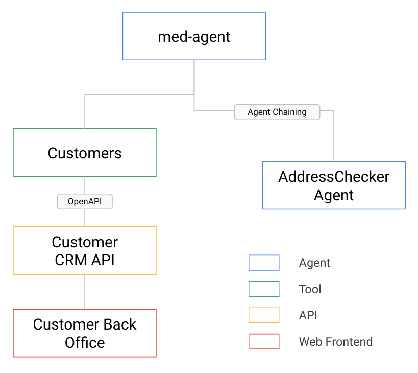
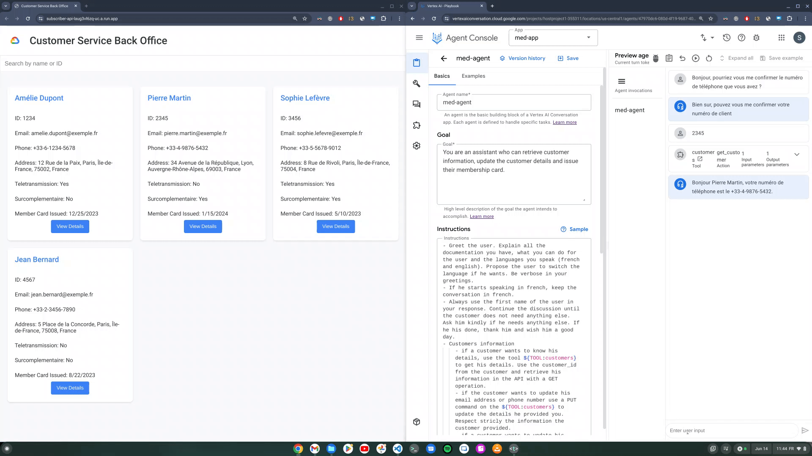

# Vertex AI Agent Builder for a customer assistant
This project provides the demo of an Agent that simulates an insurance chatbot. The goal of this agent is the following :

"**You are an assistant who can retrieve customer information, update the customer details and issue their membership card.**"

**Disclaimer** : This is not supported code by Google and is provided as is, without warranties of any kind.

This demonstration agent is built using [Vertex AI Agent Builder](https://cloud.google.com/generative-ai-app-builder/docs/introduction) from Google Cloud. [Agent Apps](https://cloud.google.com/dialogflow/vertex/docs/concept/agent-apps) are currently in Preview and shall not be used in production.

## Architecture Design

This agent only demonstrates the integration of a simple OpenAPI tool and agent chaining, but you could also add [Data stores](https://cloud.google.com/dialogflow/vertex/docs/concept/data-store) or Functions when the agent is deployed.


## Components
The content of this repo holds the following resources :
- **Agent Application** A Zip file that you can import in Vertex AI Agent Builder
- **Web Service** A web application using Python and Javascript that exposes a frontend website and an API.



## Setup

### Prerequisites
This application is deployed using an bash script that will deploy the content to a Google Repo and create a Cloud Run service using the [gcloud](https://cloud.google.com/sdk/docs/install) official Google Cloud cli. Hence you need
- A Google Cloud project and access to the [Google Cloud Console](https://console.cloud.google.com/)
- User rights on your project (the Cloud Run and Cloud Build API services will be enabled by the script)
- bash
- the [gcloud](https://cloud.google.com/sdk/docs/install) utility

### Set variables

In the setup.sh file, you will need to set the PROJECT_ID and LOCATION variables.

### Deployment

The deployment will consist in two phases :
- 1/ Deploy a web service to Cloud Run for the frontend and API that simulates a CRM
- 2/ Import the Agent in the Agent Builder service

#### Deploy to Cloud Run
Download this repo and navigate to the appropriate folder.

Run the setup script :
```
user@penguin:~/med-agent$ ./setup.sh 
```

The setup script will display a Service URI such as :
Service URL: https://customer-api-xxxxxxx-uc.a.run.app

You need to copy this URI and replace it in the `script.js` and `openapi.yaml` files so the API endpoint can be declared in the app. In the `script.js` file, you need to keep the /api/customers route.

Once you have replaced the URI in the files, run the setup script again using the same command :
```
user@penguin:~/med-agent$ ./setup.sh 
```

#### Deploy the Agent
- Go to the [Google Cloud Console](https://console.cloud.google.com/)
- Navigate to the "Agent Builder" app (use the search bar if unsure)
- Go to the "Apps" section in the left menu and click the "Create App" button at the top
- Select the type "Agent"
- Give a "Name" to your agent and select a "Region". Ideally select the same region as where you deployed your Cloud Run service in the previous section.
- Once the App is created there is an icon at the top of your screen (two arrows up/down) that enable you to export/restore an app.
- Upload the agent contained in the `med-app.zip` file in this repo.

## Using the models
Models vary as new ones are being released. This was tested using "gemini-1.0-pro-001".

## Troubleshooting & known issues
It seems the Test Cases are currently meeting and issue so they may not be working upon deployment.